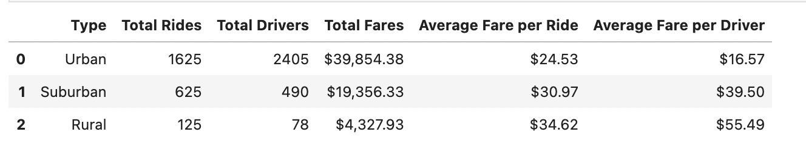
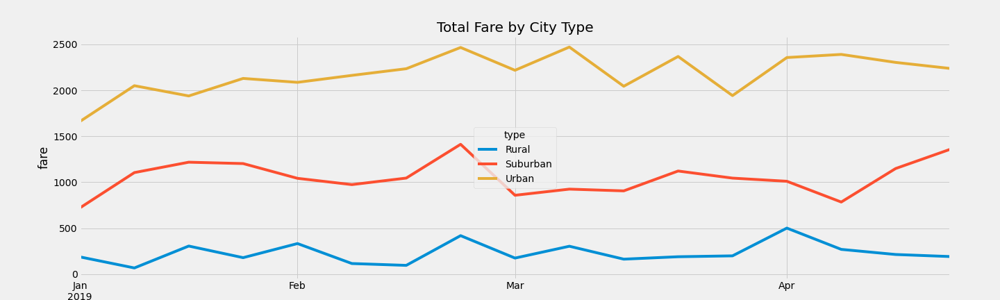

# PyBer_Analysis

## Overview 

The purpose of analysis is to create visualizations of rideshare data for PyBer to help improve access to ride-sharing services and determine prices for different city types.

## Results

## Summary

Urban cities have a higher number of rides and drivers, the average fare per ride and average fare per driver are the lowest suburban and rural city types. A higher number  rural cities show the lowest number of total rides and drivers, and unlike the urban cities, the average fare per ride and average fare per driver are the highest. Charge more per mile in urban cities because trips most likely are shorter and drivers dont earn as much per trip would be a recommendation. 
